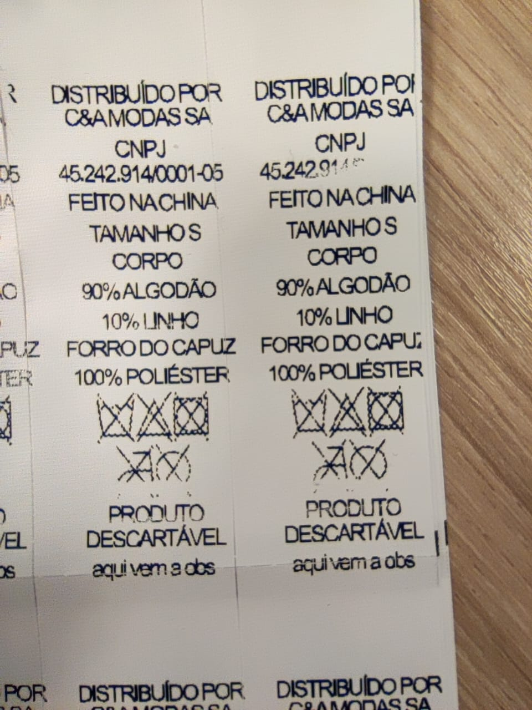
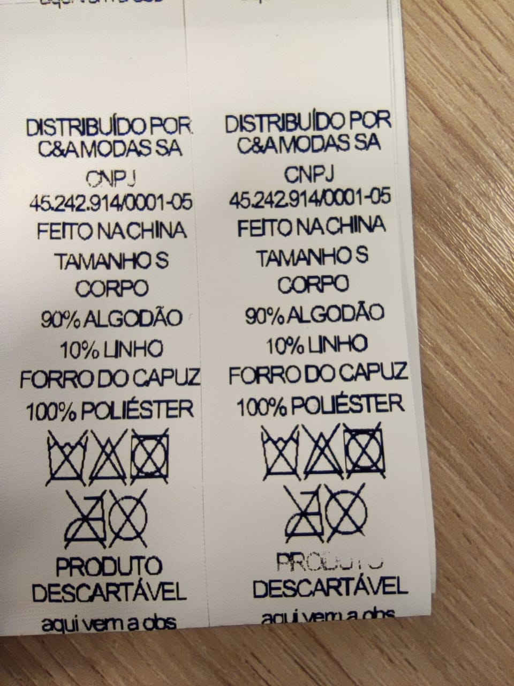
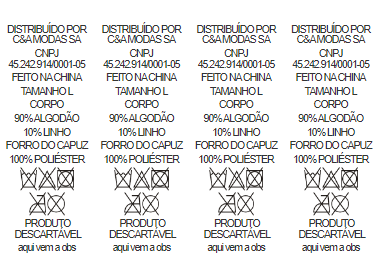

# poc-desktop-thermal-printer

# Objetivo

Desenvolver um app que interaja com as propriedades de impressão dos dispositivos de impressão.

# Justificativa

Hoje para que uma etiqueta seja imprimida é necessário configurar os atributos de impressão do dispositivo. A configuração é feita manualmente pela equipe interna de help-desk e consome muito tempo, esforço e recurso humano. A intenção é desenvolver um app que configure a impressora automaticamente preservando os aspectos visuais do documento enviado.

**Detalhamento**

Quando é necessário imprimir uma etiqueta, o documento é enviado para impressora de duas formas. A primeira seria através da tela de impressão do sistema operacional e a segunda através de um arquivo PDF comumente enviados à gráficas para impressão.

A primeira alternativa é a mais usada pelos clientes. O cliente acessa a tela de impressão do sistema operacional, seleciona a sua impressora configurada, adiciona parâmetros de impressão e manda imprimir. Entretanto, antes de mandar imprimir arquivos é necessário configurar a impressora a máquina e é nesse ponto que mora o problema. A configuração não é simples e intuitiva e também varia conforme o modelo e marca da impressora.

Toda máquina de impressão precisa de um driver para retirar o melhor do seu potêncial, esse driver pode ser pré-instalado no seu computador (genérico), pode ser fornecido pelo fabricante do dispositivo (recomendado) ou ser um software que interage com diversas máquinas de impressão como o [Bartender](https://www.seagullscientific.com/).

Para configurar uma máquina, é necessário ter um driver instalado (fornece uma UI de configuração) e acessar suas propriedades de impressão para adequar o arquivo a impressão. Porém **por vezes o driver usado não atende a qualidade potêncial e esperada pelos clientes. A expectativa da POC é servir como base para entender a viabilidade da contrução do app que substitua o processo de implantação existente.**

    </img>
    </img>

A segunda alternativa acontece quando é enviado um arquivo para a gráficas de impressão. Esse arquivo precisa ter seus vetores preservados para imprimir com a qualidade esperada (estudo realizado [poc-label-printing](https://www.notion.so/poc-label-web-printing-07245eb8442047fe9594dae5635df50c?pvs=21)).

Normalmente as gráficas trabalham com PDFs e importam o documento para o CorelDraw afim de conformar às condições de impressão da impressora. Esse processo de conformidade se dá com o intuito de criar as grades de tamanhos para impressão nas mídias de etiquetagem. Em resumo, inserir as etiquetas lado a lado conforme a quantidade de etiqueta por mídia.

    </img>

Nesse cenário moram dois problemas, quando o arquivo PDF é aberto no CorelDraw o arquivo não tem seus vetores preservados se o documento não está “travado” como o subtipo `PDFX/1-a`. A com essa POC é também eliminar a necessidade de abrir o arquivo no Corel através da configuração da etiqueta integrada entre sistema-aplicativo.

# Premissas

- [ ] App construído com ElectronJs.
- [ ] A configuração se baseia fundamentalmente em:
  - [ ] Selecionar a impressora de etiqueta.
  - [ ] Montar grade de etiquetas (colunas).
  - [ ] Definir impresão de uma só página.
- [ ] Ativar a impressão diretamente pelo aplicativo.

# Propostas Avaliadas

- Destrinchamento do problema (Pesquisa inicial)
- Quais as melhores abordagens e tecnologias para criar nosso próprio aplicativo?
- Como se dá a implementação com ElectronJs?
- O que se espera do aplicativo final (pós prova de conceito)? (Referências)
  -  [LABELVIEW | Barcode label design application](https://www.teklynx.com/en/products/label-design-solutions/labelview)
  - [Label Template Library | BarTender](https://www.seagullscientific.com/support/downloads/template-library/)
  - [NiceLabel download for existing customers](https://www.loftware.com/customer-center/downloads/nicelabel-download-for-existing-customers)
  - [Cinco programas para imprimir etiquetas grátis](https://www.techtudo.com.br/listas/2019/03/cinco-programas-para-imprimir-etiquetas.ghtml)

# Avaliação das Propostas
[Como funcionam os drivers de uma impressora? | [pesquisa]](./PRINT-DRIVERS-SEARCH.md)

A formular..

# Resultados Obtidos
A formular..

---

# Referências

[https://medium.com/coderbyte/generate-a-pdf-with-javascript-3e53ca7b47e](https://medium.com/coderbyte/generate-a-pdf-with-javascript-3e53ca7b47e)

[https://dev.to/handdot/generate-a-pdf-in-js-summary-and-comparison-of-libraries-3k0p](https://dev.to/handdot/generate-a-pdf-in-js-summary-and-comparison-of-libraries-3k0p)

[https://stackoverflow.com/questions/312230/proper-mime-media-type-for-pdf-files](https://stackoverflow.com/questions/312230/proper-mime-media-type-for-pdf-files)

[https://www.devmedia.com.br/manipulando-pdf-com-ghostscript/34424](https://www.devmedia.com.br/manipulando-pdf-com-ghostscript/34424)

[https://portswigger.net/research/portable-data-exfiltration](https://portswigger.net/research/portable-data-exfiltration)

    
Feito com 💙

